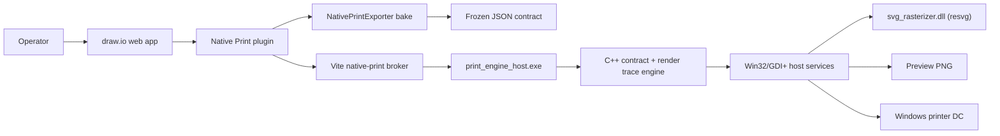
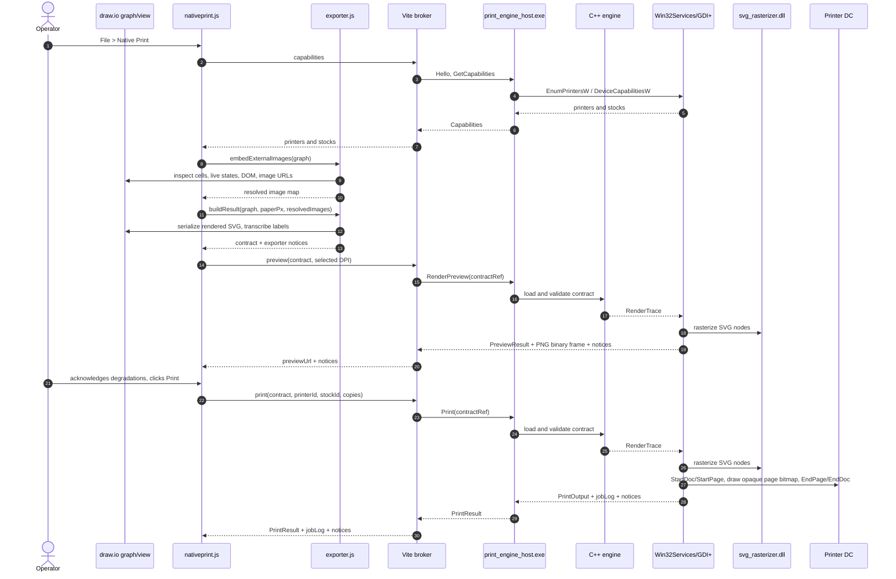
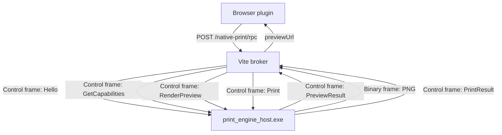
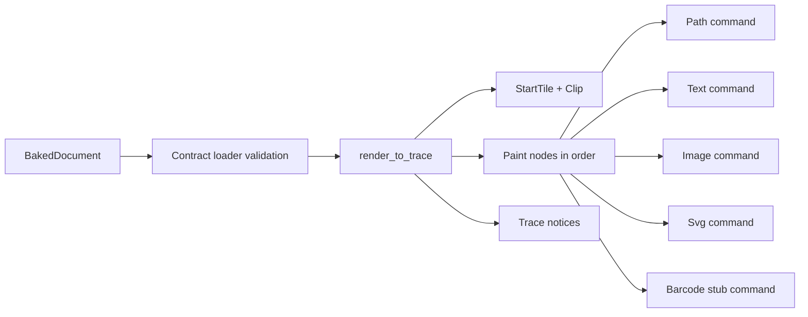
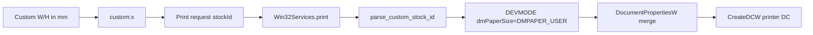
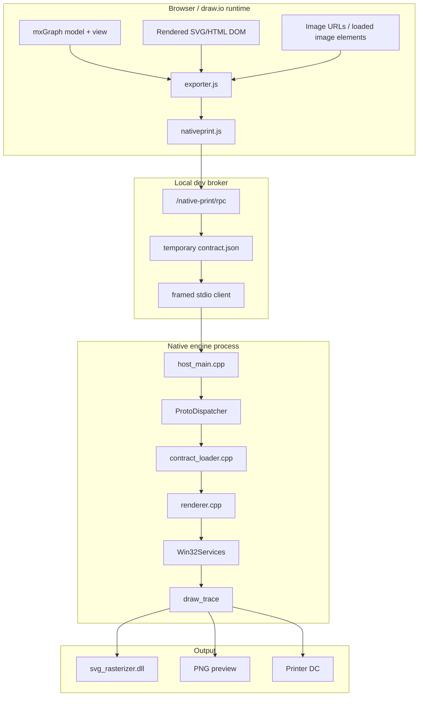

# Draw.io Native Print: Design-to-C++ Output Software Specification

**Status:** Current working-tree specification  
**Date:** 2026-05-24  
**Repository:** `E:\Dev\drawio`  
**Audience:** engineering leadership, maintainers, and reviewers who need to understand how a draw.io design becomes native C++ print output.

## 1. Executive Summary

Native Print adds a Windows-oriented print path to the local draw.io web app. The key design decision is that the C++ engine core does not understand draw.io, mxGraph, shape libraries, stencils, editor state, or browser layout. Instead, the browser-side plugin "bakes" the current diagram into a frozen JSON contract. The native engine validates that contract, converts contract coordinates to device coordinates, and the Win32 host renders it to either a preview bitmap or a printer device context.

The current WYSIWYG strategy is "faithful render or loud notice." In the live browser path, the exporter primarily serializes each cell's actual rendered SVG into `kind:"svg"` contract nodes. HTML labels that would otherwise serialize as `<foreignObject>` are transcribed into plain SVG text, rectangles, images, and decorations before the contract is sent to native code. The native host then rasterizes those SVG nodes through a runtime-loaded `svg_rasterizer.dll` backed today by Rust `resvg`.

Preview and print share the same native trace-generation pipeline and the same host `draw_trace` renderer. That is the main parity mechanism: what the operator approves in preview is generated by the same C++/GDI+ path used for print, with only the output sink and target DPI differing.

## 2. Primary Requirements

| Requirement | Current implementation |
|---|---|
| WYSIWYG output | The browser bake ships actual rendered SVG wherever possible; any known fidelity loss emits a notice. |
| Native C++ output | The contract is consumed by `src/main/native-print-engine`; output is emitted by Win32/GDI+ services. |
| No draw.io concepts in engine core | Core engine types are contract, geometry, renderer, protocol, and result types only. Host code is separate. |
| Preview/print parity | Both preview and print call the same `render_to_trace` and `draw_trace` code paths. |
| Frozen contract boundary | Contract schema is versioned with `schema.major = 1`, `schema.minor = 0`. |
| Loud failure | Invalid contract, missing merge data, failed device operations, unsupported SVG, and rasterizer failures become typed errors or notices. |
| External image fidelity | Exporter attempts direct fetch, proxy fetch, and authorized canvas transcode to embed images before print. |
| Custom stock | UI emits `custom:<wMicrons>x<hMicrons>`; host maps it to `DMPAPER_USER` and explicit `DEVMODE` dimensions. |

## 3. Source Map

| Area | Files |
|---|---|
| Native Print UI | `src/main/webapp/plugins/nativeprint.js` |
| Browser bake/exporter | `src/main/webapp/plugins/nativeprint/exporter.js` |
| Exporter tests | `src/main/webapp/plugins/nativeprint/exporter.test.mjs` |
| Dev broker | `src/main/webapp/vite.config.mjs` |
| Contract types | `src/main/native-print-engine/include/print_engine/contract.hpp` |
| Contract loader | `src/main/native-print-engine/src/contract_loader.cpp` |
| Render trace | `src/main/native-print-engine/include/print_engine/renderer.hpp`, `src/main/native-print-engine/src/renderer.cpp` |
| Protocol | `src/main/native-print-engine/include/print_engine/proto.hpp`, `src/main/native-print-engine/src/proto.cpp` |
| Protocol adapter | `src/main/native-print-engine/include/print_engine/proto_adapter.hpp`, `src/main/native-print-engine/src/proto_adapter.cpp` |
| Host executable | `src/main/native-print-engine/host/host_main.cpp` |
| Win32 output | `src/main/native-print-engine/host/win32_services.cpp` |
| SVG rasterizer ABI | `src/main/native-print-engine/host/svg_rasterizer_abi.h` |
| SVG rasterizer loader | `src/main/native-print-engine/host/svg_rasterizer.hpp`, `src/main/native-print-engine/host/svg_rasterizer.cpp` |
| Rust resvg backend | `src/main/native-print-engine/host/svg-rasterizer/src/lib.rs` |
| Custom stock parser | `src/main/native-print-engine/host/custom_stock.hpp`, `src/main/native-print-engine/host/custom_stock.cpp` |
| Native print memory/guardrails | `docs/MEMORY.md`, `docs/CLAUDE.md`, `src/main/webapp/plugins/nativeprint/CLAUDE.md` |
| Original implementation spec | `docs/PRINT_ENGINE_SPEC_v1.1.md` |

## 4. System Context



The browser never sends editor internals to the native engine. It sends a completed JSON contract. The dev broker is only a transport bridge: HTTP from the browser to localhost, length-prefixed stdio frames from Node to the C++ host.

## 5. End-to-End Print Sequence



## 6. Runtime Components

### 6.1 Native Print UI

`nativeprint.js` attaches to draw.io with `window.Draw.loadPlugin`, adds the `nativePrint` action, and inserts `File > Native Print`.

The dialog is responsible for:

- checking that `window.NativePrintExporter` is loaded;
- asking the broker for printer and stock capabilities;
- letting the operator choose printer, stock, custom dimensions, and copies;
- rebaking whenever paper/printer/custom dimensions change the contract;
- rearming preview approval when any print input changes, including copy count;
- rendering a preview before enabling print;
- combining exporter notices and host/engine notices;
- blocking Print until every degradation notice is acknowledged;
- submitting the final print request.

The dialog intentionally invalidates the previous preview and acknowledgement state on input changes. This prevents approval of one contract/stock combination and printing another.

### 6.2 Browser Exporter

`exporter.js` is the design-to-contract conversion layer. It runs inside the draw.io browser runtime, where it can access:

- `graph.getModel()`;
- `graph.view`;
- live cell states;
- live SVG DOM nodes;
- live HTML label DOM nodes;
- current theme colors;
- image URLs and loaded image elements.

The exporter returns:

```js
{
  contract: { schema, document },
  notices: [ ... ]
}
```

The main entry points are:

- `buildResult(graph, paper, opts)`;
- `buildContract(graph)`;
- `embedExternalImages(graph, fetchImpl, canvasImpl, proxyBase)`;
- `noticeSeverity(kind)`.

### 6.3 Dev Broker

`vite.config.mjs` embeds the native print broker as Vite middleware. It exposes browser-facing routes under `/native-print` and launches `print_engine_host.exe` as a child process.

The browser-to-broker protocol is JSON over same-origin HTTP. The broker-to-engine protocol is length-prefixed stdio frames:

- control frame: JSON command or response;
- binary frame: preview PNG payload, correlated by stream id.

The broker writes the contract to a temporary file and passes `{ contractRef: { path } }` to the engine. After the operation, it sends `ReleaseContract` and deletes the temp file/directory. The file is written with a restrictive mode request; the engine still validates the contract and does not trust the transport.

The broker is development-oriented. It binds to localhost and checks the request `Origin`. The current working tree also contains temporary debug endpoints and an auto-bake harness in `nativeprint.js` and `vite.config.mjs`; those are useful diagnostics, not production behavior and should not be treated as part of the stable product surface.

### 6.4 C++ Engine Core

The engine core is under `src/main/native-print-engine/include/print_engine` and `src/main/native-print-engine/src`.

Responsibilities:

- parse and validate the JSON contract;
- enforce schema major-version compatibility;
- reject invalid values and unsupported enum values;
- convert contract units to device pixels through a single world transform;
- resolve merge values when supplied;
- emit barcode stubs until a real barcode SDK adapter exists;
- produce a `RenderTrace` containing ordered drawing commands and notices.

The core does not render to a printer directly. It emits trace commands such as `Path`, `Text`, `Image`, `Svg`, `Barcode`, `StartTile`, and `Clip`.

### 6.5 Win32 Host Services

`win32_services.cpp` is the Windows production host implementation. It owns:

- printer enumeration using `EnumPrintersW`;
- stock enumeration using `DeviceCapabilitiesW`;
- `DEVMODE` merging through `DocumentPropertiesW`;
- custom stock handling with `DMPAPER_USER`;
- preview bitmap generation;
- printer DC output;
- GDI+ drawing;
- SVG rasterizer loading and use.

Preview and print share `draw_trace`. This is the key implementation point for preview/print parity.

### 6.6 SVG Rasterizer Backend

The C++ host loads `svg_rasterizer.dll` from next to `print_engine_host.exe`. The DLL must implement the hand-owned ABI in `svg_rasterizer_abi.h`.

Current backend:

- Rust cdylib;
- `resvg` 0.47 / `tiny-skia`;
- exports `spe_svg_abi_version`, `spe_svg_backend_id`, `spe_svg_measure`, and `spe_svg_render`;
- returns straight RGBA8, top-down, tightly packed;
- catches panics before crossing the C ABI;
- refuses `<foreignObject>` loudly.

The host converts straight RGBA to premultiplied BGRA for GDI+ `PixelFormat32bppPARGB`.

## 7. Design-to-Contract Bake

### 7.1 Inputs

The bake starts from the current draw.io graph and the selected paper:

- model cells;
- graph view scale and translation;
- graph bounds;
- per-cell live state;
- per-cell rendered SVG node;
- per-cell text node;
- selected paper size converted to 96 px/in contract units.

When paper is supplied, the contract page is the selected stock size in 96-DPI pixels. The diagram is not scaled up to fill the paper. This preserves 1:1 design size and adds whitespace for larger paper.

### 7.2 Coordinate System

The contract uses `px` units at 96 px/in. The exporter maps live view coordinates back to zoom-independent contract coordinates.

Important current behavior:

- The origin is the draw.io page origin when view translation is available.
- The origin is not the graph bounds top-left, because that would remove user-authored page margins.
- Each selected stock becomes one contract page and one tile by default.
- The engine later maps contract units to device pixels as `dpi / 96`.

### 7.3 Z-Order

The exporter uses graph tree order through `collectCellsInZOrder(model)`. This walks root, layers, descendants, and group children in the order draw.io paints them.

This is required because `model.cells` dictionary order does not reflect user actions like Send to Back or Bring to Front.

### 7.4 Primary Live SVG Path

For both vertices and edges, the primary path is `svgCellNode(...)`.

This function:

1. Serializes the cell's actual rendered SVG shape node.
2. Serializes SVG-native text when present.
3. Finds HTML label `<foreignObject>` nodes and transcribes them before shipping.
4. Expands the SVG box to include stroke, marker, rotation, and external label bounds.
5. Collects needed SVG definitions.
6. Resolves draw.io theme CSS functions such as `light-dark(...)` and `var(...)` to concrete active-theme colors.
7. Adds a sans-serif fallback to Helvetica so native text does not fall back to serif.
8. Emits a contract node:

```json
{
  "kind": "svg",
  "box": { "x": 10, "y": 20, "w": 120, "h": 60 },
  "source": "base64-encoded-svg-bytes",
  "aspect": "preserve"
}
```

This design avoids reimplementing draw.io's shape logic in C++. The native engine receives artwork, not editor semantics.

### 7.5 HTML Label Transcription

Native SVG rasterizers do not render HTML in `<foreignObject>` reliably. The exporter therefore never intentionally sends `<foreignObject>` to native code.

`transcribeForeignObjects(...)` measures live HTML label content and emits plain SVG:

- text fragments are measured with DOM `Range.getClientRects()`;
- each fragment becomes SVG `<text>`;
- label backgrounds become SVG `<rect>`;
- CSS borders become SVG strokes or line segments;
- supported list markers are emitted as SVG text;
- inline `` elements become SVG `<image>` when embeddable or readable;
- CSS background images and gradients become SVG where supported.

If an HTML label contains visible text but cannot be measured, the exporter throws a `NativePrintFatal` and refuses to print rather than silently dropping or approximating the label.

### 7.6 Image Embedding

The exporter tries to ensure images are local, embeddable data URIs before they reach the native engine. `embedExternalImages(...)` collects image references from:

- image cells;
- inline label images;
- CSS `url(...)` backgrounds.

It resolves each source in parallel:

1. direct `fetch(url)`;
2. proxy fetch through `PROXY_URL`;
3. authorized canvas decode/re-encode to PNG.

This canvas use is intentionally limited to embedding artwork for print fidelity. It is not used as a browser pixel oracle or verification mechanism.

Embeddable formats for SVG rasterization include PNG, JPEG, GIF, and nested SVG. Browser-decodable formats that the backend cannot directly render can be transcoded to PNG by canvas in the browser path. The resolved image map is threaded into image cells and HTML labels; unresolved images are loudly noticed in the manual/fallback image paths. Live serialized image cells rely on this pre-resolution step to replace external `<image>` hrefs before native rasterization.

### 7.7 Fallback Paths

When live SVG serialization is unavailable, the exporter falls back in layers:

1. `harvestShape(...)` walks draw.io's rendered SVG primitives and converts them to contract `path` or `image` nodes.
2. Named-shape geometry is used only as a last resort.
3. Unsupported shapes or skipped fragments emit `ExporterUnsupportedShape`.
4. Unsupported or unreachable images emit `ExporterUnsupportedImage`.
5. Gradient direction loss in fallback `path` nodes emits `GradientDirectionApprox`.

The intended behavior is not "best effort silently." It is "use the faithful live path, or emit a precise notice when falling back."

## 8. Contract Schema

### 8.1 Top-Level Shape

```json
{
  "schema": { "major": 1, "minor": 0 },
  "document": {
    "units": "px",
    "pages": [
      {
        "id": "page-1",
        "size": { "w": 816, "h": 1056 },
        "tiles": [
          {
            "origin": { "x": 0, "y": 0 },
            "size": { "w": 816, "h": 1056 }
          }
        ],
        "paint": []
      }
    ]
  }
}
```

### 8.2 Paint Node Kinds

| Kind | Purpose | Current role |
|---|---|---|
| `svg` | Opaque SVG artwork bytes in base64 | Primary live WYSIWYG path for cells. |
| `image` | PNG raster payload | Used for PNG image paths and some fallback image cases. |
| `path` | Absolute SVG path plus fill/stroke | Fallback vector geometry and placeholders. |
| `text` | Static, rich, or merge text | Mostly fallback/headless path; host can layout with GDI+ metrics. |
| `barcode` | Barcode descriptor | Engine emits loud barcode stub until SDK adapter exists. |

### 8.3 Schema Validation

The C++ contract loader enforces:

- `schema.major` must equal supported major `1`;
- `schema.minor` greater than supported minor is accepted and marked as minor-ahead;
- `document.units` must be `px`;
- page and tile sizes must be positive;
- paint node kinds and enum fields must be recognized;
- image payloads must be PNG, valid base64, and not carry a refused PNG ICC profile for `kind:"image"`;
- SVG source must be non-empty and base64-like for `kind:"svg"`;
- merge and barcode policies must be structurally valid.

Major schema mismatch is a hard contract error. Minor-ahead is treated as additive version skew. The loader records it, `GetContractFields` emits `SchemaMinorAhead`, and preview/print responses include the schema version; the current preview/print path does not add a separate `SchemaMinorAhead` notice.

## 9. Browser-to-Native Protocol



The stdio frame format is:

- 4 bytes little-endian frame length;
- 1 byte frame type;
- 4 bytes stream id;
- payload bytes.

Engine protocol operations include:

- `Hello`;
- `Ping`;
- `GetCapabilities`;
- `GetContractFields`;
- `RenderPreview`;
- `Print`;
- `ReleaseContract`;
- `Shutdown`.

`RenderPreview` returns a control message and a separate binary PNG frame. `Print` returns a control message with job id, notices, and job log.

## 10. C++ Render Trace

The engine converts a validated `BakedDocument` into `RenderTrace`.



### 10.1 Transform

The world transform is:

```text
scale = target.dpi / 96
device.x = (contract.x - tile.origin.x) * scale
device.y = (contract.y - tile.origin.y) * scale
```

This transform is shared by all node kinds.

### 10.2 Node Handling

| Contract node | Render trace behavior |
|---|---|
| `path` | Parses absolute SVG path data and emits path commands with fill/stroke. |
| `text` | Resolves static/rich/merge text and forwards box, font, wrap, overflow, and rich runs to host. |
| `image` | Forwards PNG data, aspect, and flip flags. |
| `svg` | Forwards base64 SVG source and target raster size; engine does not parse SVG. |
| `barcode` | Resolves value if needed and emits a loud crosshatch stub command plus `StubbedBarcode`. |

The current renderer intentionally no longer emits `StubbedSvgArtwork` unconditionally for every `svg` command. The host decides whether SVG rasterization succeeded or failed:

- success: `SvgArtworkRasterized`;
- failure: crosshatch plus `StubbedSvgArtwork` with reason.

### 10.3 Hardware Margin Notice

The renderer checks whether paint node boxes escape the selected page. If content extends past the selected paper, it emits `HardwareMarginClip`. A tolerance exists for exporter SVG padding so normal stroke/marker padding at the page edge does not create noise.

## 11. Host Rendering

### 11.1 Shared `draw_trace`

`draw_trace(Gdiplus::Graphics&, RenderTrace, ISvgRasterizer*)` is shared by preview and print.

It handles:

- anti-aliased path fills and strokes;
- GDI+ text layout and font substitution;
- merge text shrink/clip/reject behavior at device metrics;
- rich text runs, underline, and strikethrough;
- PNG image decode and placement;
- SVG rasterization and GDI+ bitmap draw;
- barcode crosshatch stubs.

Because preview and print both call this function, the same layout and rasterization decisions are used for both output modes.

### 11.2 Preview Output

`render_preview(...)`:

1. creates a render target at requested DPI;
2. calls `render_to_trace`;
3. splits trace into previewable tiles;
4. creates a GDI+ bitmap;
5. clears it to white;
6. calls `draw_trace` for each tile;
7. encodes the result as PNG;
8. returns the PNG bytes, dimensions, and notices.

The broker stores the PNG in memory behind a short token and returns `previewUrl` to the browser.

### 11.3 Print Output

`print(...)`:

1. merges printer settings and selected stock into `DEVMODE`;
2. opens a printer DC with `CreateDCW`;
3. gets device DPI from the DC;
4. calls `render_to_trace`;
5. starts a Windows print job with `StartDocW`;
6. for each copy and tile, calls `StartPage`;
7. renders the page to an opaque white memory bitmap;
8. draws the bitmap to the printer DC;
9. calls `EndPage` and finally `EndDoc`.

The intermediate opaque bitmap is deliberate. It avoids printer-driver alpha artifacts by compositing all antialiased geometry into a normal bitmap before sending it to the printer.

If a page fails mid-job, the host calls `AbortDoc` and returns a typed print-device error rather than silently producing a partial job.

### 11.4 SVG Rendering

For `Svg` trace commands, the host:

1. checks that a rasterizer backend is loaded;
2. decodes base64 SVG bytes;
3. scans for `<foreignObject>` as defense in depth;
4. calls `ISvgRasterizer::render(svgBytes, targetW, targetH, dpi)`;
5. validates output size and buffer length;
6. converts straight RGBA to premultiplied BGRA;
7. constructs a GDI+ bitmap;
8. draws the bitmap into the command destination.

On success it emits `SvgArtworkRasterized` with the backend identity. On failure it draws a visible crosshatch stub and emits `StubbedSvgArtwork` with the reason.

## 12. Notice and Gate Model

Notices come from three places:

- exporter bake notices;
- engine trace notices;
- host drawing notices.

The UI asks `NativePrintExporter.noticeSeverity(kind)` for severity. Unknown kinds fail safe as degradations.

| Notice kind | Source | Meaning | UI severity |
|---|---|---|---|
| `SvgArtworkRasterized` | Host | SVG rendered successfully by external rasterizer. | silent |
| `HardwareMarginClip` | Engine | Diagram extends beyond selected paper and will be clipped. | info |
| `SchemaMinorAhead` | Protocol | Contract minor version is newer than engine; currently emitted by `GetContractFields`. | info |
| `ProtoMinorAhead` | Protocol | Peer protocol minor version is newer. | info |
| `StubbedSvgArtwork` | Host | SVG could not rasterize; crosshatch stub printed. | degradation |
| `StubbedBarcode` | Engine/host | Barcode SDK adapter not implemented; stub printed. | degradation |
| `FontSubstituted` | Host | Requested font not installed; Arial used. | degradation |
| `MergeClip` | Host | Text clipped to its box. | degradation |
| `ExporterUnsupportedShape` | Exporter | Shape or fragment could not be faithfully exported. | degradation |
| `ExporterUnsupportedImage` | Exporter | Image could not be embedded; placeholder used. | degradation |
| `RichApproximate` | Exporter | HTML/CSS feature approximated. | degradation |
| `RichUnsupported` | Exporter | HTML/CSS feature omitted or unsupported. | degradation |
| `GradientDirectionApprox` | Exporter | Fallback path lost gradient direction. | degradation |
| `AnimatedSvgFrozen` | Exporter | Animated SVG will print as a still frame. | degradation |
| `SvgListMarkerApprox` | Exporter | Nonstandard list marker approximated. | degradation |

Print is enabled only after:

1. a preview exists for the current contract and selected stock;
2. every degradation notice is acknowledged.

Informational notices do not block print. Silent notices are not shown.

## 13. Custom Stock Flow



The UI refuses non-positive custom dimensions and dimensions greater than 3276.7 mm. The host parser also refuses invalid strings and values that cannot fit in `DEVMODE.dmPaperWidth` or `dmPaperLength`.

## 14. Error Handling

The system is biased toward explicit refusal over silent wrong output.

| Failure | Behavior |
|---|---|
| Exporter cannot measure visible HTML label | `NativePrintFatal`; no stale preview or print. |
| Unsupported shape fallback | Visible placeholder or reduced output plus degradation notice. |
| External image cannot be fetched/proxied/read | Placeholder plus `ExporterUnsupportedImage`. |
| Contract schema major mismatch | Typed contract-version error. |
| Invalid contract field | Typed validation error. |
| Missing merge value at print/preview | `MergeResolveError`. |
| Merge value exceeds max length | `MergeOverflowError`. |
| SVG rasterizer DLL missing | Crosshatch SVG stub plus `StubbedSvgArtwork`. |
| SVG contains `<foreignObject>` | Refused by host/Rust guard, crosshatch plus notice. |
| Printer operation fails mid-job | `AbortDoc`, typed `PrintDeviceError`. |

## 15. Security and Isolation

Current protections:

- Engine process communicates through stdio, not a TCP listener.
- Dev broker binds to localhost through Vite.
- Broker checks allowed origins.
- Browser never speaks raw engine frames.
- Contract temp files are written with a restrictive mode request and deleted after `ReleaseContract`.
- Engine validates every contract regardless of whether it came from inline JSON or a file path.
- C++ core is separated from Win32 host services.
- SVG rasterizer backend uses a fixed C ABI with caller-owned buffers and no cross-ABI allocations.
- Rust backend catches panics at exported functions.

Current development-only surfaces:

- `/native-print/debug`;
- `/native-print/testfile`;
- `nativeprint.js` auto-bake diagnostic harness.

Those should be removed or explicitly feature-gated before production packaging.

## 16. Current Limitations

| Limitation | Impact |
|---|---|
| Barcode SDK adapter is not implemented | Barcode nodes print as loud crosshatch stubs. |
| Real merge-data UI/source is not complete in the draw.io plugin | Protocol and engine support merge maps, but UI currently sends empty merge data. |
| Dev broker assumes local Vite environment | Production packaging needs an equivalent trusted local bridge. |
| SVG rasterizer DLL must be present beside `print_engine_host.exe` | Missing DLL causes loud crosshatch stubs for SVG artwork. |
| Some external images can still be unreachable | If direct fetch, proxy, and canvas all fail, output is a noticed placeholder. |
| Some user-embedded animated SVG content prints as still frame | Exporter emits `AnimatedSvgFrozen`. |
| Debug harness is present in working tree | Useful for validation, but not production behavior. |
| Schema minor-ahead notice is only partially surfaced | The loader tracks minor-ahead and `GetContractFields` emits `SchemaMinorAhead`; preview/print currently return `schemaVersion` without adding that notice. |

## 17. Verification Strategy

The repository contains both browser-free exporter tests and native C++ tests.

Recommended verification commands from the current repo:

```powershell
npm run test:nativeprint-exporter
npm run test:nativeprint-validate
cmake -S src/main/native-print-engine -B src/main/native-print-engine/build -DBUILD_TESTING=ON
cmake --build src/main/native-print-engine/build
ctest --test-dir src/main/native-print-engine/build --output-on-failure
```

Important test areas visible in the current tree:

- contract loader and validation;
- architecture invariants;
- path parsing and emit;
- static text and rich text;
- raster image and SVG behavior;
- merge and barcode stubs;
- preview/print targets;
- protocol adapter;
- custom stock parser;
- SVG rasterizer ABI;
- SVG pixel determinism and foreignObject refusal;
- WYSIWYG parity tests.

The exporter tests include contract-shape checks and many browser-runtime simulations for live SVG harvesting, HTML label transcription, z-order, image embedding, theme colors, SVG animation notices, and fallback notices.

Verification run while producing this document:

| Command | Result |
|---|---|
| `npm run test:nativeprint-exporter` | Passed, 157/157 tests. |
| `npm run test:nativeprint-validate` | Passed, 16/16 tests. |
| `ctest --test-dir src/main/native-print-engine/build --output-on-failure` | Passed, 112/112 tests in the existing native build. |

## 18. Implementation Model



## 19. Design Rationale

The system avoids a native reimplementation of draw.io. That is the most important architectural choice. Recreating draw.io shapes, routes, text layout, themes, stencils, markers, gradients, filters, and HTML labels in C++ would be brittle and likely to diverge silently. Instead, the browser bakes what draw.io already rendered, and the native side treats it as artwork under a strict, versioned contract.

The cost is that the bake must be careful and the native host needs an SVG rasterizer. The benefit is a small and testable native engine boundary:

- validate contract;
- apply transform;
- render ordered primitives;
- surface every known degradation.

That division is what makes the current implementation explainable, maintainable, and reviewable after the fact.
