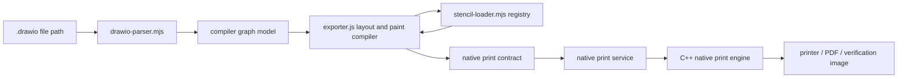
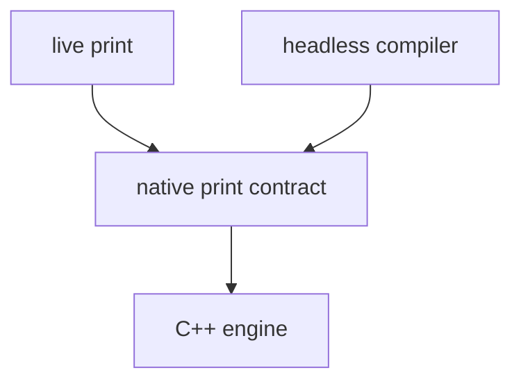

# Native Print - Headless Compiler Production Design Plan

Status: revised after design review  
Date: 2026-05-25  
Scope: unattended native printing from arbitrary `.drawio` files without a browser

## Review Disposition

The proposed Node VM + mxGraph + strict SVG DOM shim path is rejected.

Reason: frontend mxGraph rendering is not a pure SVG serializer. It relies on browser
visual APIs for layout, label placement, SVG bounding boxes, style resolution, and text
measurement. A strict shim would fail on APIs such as `getBBox` and
`getComputedStyle`; a permissive shim would become an incomplete browser/layout engine.
That would be fragile and would not satisfy the hard no-browser requirement.

The production headless path should instead be the existing browser-free compiler:

1. `tools/native-print-bake/drawio-parser.mjs`
2. `tools/native-print-bake/stencil-loader.mjs`
3. `src/main/webapp/plugins/nativeprint/exporter.js`
4. `tools/native-print-bake/bake.mjs`
5. `tools/native-print-service/index.mjs`

This plan makes that compiler the official unattended headless renderer and defines the
remaining production gates around native-engine visual verification, failure policy, and
service integration.

## Hard Requirements

1. No browser engine:
   - no Chromium
   - no Electron renderer
   - no Puppeteer
   - no Playwright
   - no Selenium
   - no `jsdom`
   - no hidden browser process
2. Print unattended from a file path:
   - any local `.drawio` file
   - file may be outside the repository
   - no prior fixture knowledge
   - no file-specific overrides
3. C++ engine boundary remains unchanged:
   - C++ consumes only the native print contract
   - C++ does not parse draw.io XML
   - C++ does not know mxGraph cells, styles, stencils, or graph models
4. Production output must be visually faithful object by object.
5. Any fidelity loss must fail loudly in unattended mode.

## Final Architecture



The compiler, not C++, owns draw.io interpretation. C++ owns contract execution.

## Design Decision

The official headless renderer is a pure JavaScript mathematical compiler.

It must:

1. parse `.drawio` XML directly
2. decode compressed diagrams
3. build the graph/page model
4. compile supported shapes, labels, edges, images, gradients, groups, and stencils into
   native print contract paint nodes
5. use the stencil registry for `mxgraph.*` shapes
6. fail loudly for unsupported fidelity-impacting features

It must not:

1. run draw.io inside a browser
2. run mxGraph inside a browser-like DOM
3. depend on screen layout
4. depend on current zoom
5. silently approximate unsupported visual behavior

## Why Not The mxGraph VM Shim

The mxGraph VM shim idea has an attractive goal: reuse the frontend renderer. In
practice, it moves the hard part into the shim.

Known problem areas:

1. SVG `getBBox`
2. computed CSS style
3. text measurement
4. HTML label layout
5. font fallback behavior
6. image decoding and sizing
7. browser-specific SVG normalization
8. runtime globals expected by frontend rendering code

A strict shim would crash on these calls. A non-strict shim would need to implement them.
That implementation would become a second layout engine, which is exactly the class of
dependency the headless path is trying to avoid.

Therefore, the VM shim is not the production design.

## Production Compiler Responsibilities

### 1. File Loading

The loader must accept a `.drawio` source from anywhere on disk.

Responsibilities:

1. read the input file
2. decode `.drawio` wrappers
3. decode compressed diagram payloads
4. support multi-page files
5. preserve page size and page metadata
6. resolve local file references relative to the `.drawio` file
7. reject inaccessible or unsupported external assets in unattended mode

### 2. Graph Parsing

`drawio-parser.mjs` owns conversion from XML to the compiler model.

Required behavior:

1. parse cells
2. parse geometry
3. parse styles
4. preserve parent/child order for z-order
5. preserve layers
6. preserve edge source, target, waypoints, and labels
7. compute absolute boxes without browser layout
8. retain enough metadata for notices and diagnostics

### 3. Stencil Coverage

`stencil-loader.mjs` owns stencil registry construction.

Required behavior:

1. recursively load draw.io stencil XML
2. register stencils with mxGraph-compatible keys
3. support the full checked-in stencil corpus
4. compile stencil commands mathematically
5. fail loudly on unsupported stencil instructions

Current repo evidence indicates the registry covers 8,910 stencil shapes.

### 4. Shape And Paint Compilation

`exporter.js` owns conversion from compiler graph state to contract paint nodes.

Required output types:

1. path nodes
2. SVG nodes
3. image nodes
4. text nodes
5. rich text runs where supported
6. gradients
7. strokes, dashes, caps, joins
8. transforms
9. groups and nested z-order
10. edge paths and markers

The compiler may emit SVG nodes for complex shapes, but those SVG nodes must be generated
from deterministic math or parsed source SVG, not from browser rendering.

### 5. Labels

Labels are production-critical.

Required behavior:

1. plain labels preserve text exactly
2. multiline labels preserve line breaks
3. basic HTML labels are transcribed into deterministic SVG/text contract output
4. label background and border are preserved
5. label rotation follows cell rotation
6. edge labels preserve absolute offset and transform
7. unsupported HTML/CSS features emit blocking notices in unattended mode

No browser text measurement is allowed. Any measurement used by the compiler must be
deterministic and owned by the compiler.

### 6. Images

Supported:

1. embedded data URI images
2. PNG
3. JPEG
4. GIF
5. SVG
6. explicitly resolved bundled/local assets
7. externally fetched assets only when policy allows embedding

Unsupported or unresolved images must be blocking in unattended mode.

### 7. Fonts

The compiler and engine must agree on font availability.

Required behavior:

1. collect referenced fonts from contract text/rich text
2. preflight fonts before engine submission
3. fail if a missing font can affect layout or visual output
4. include font diagnostics in failure responses

### 8. Notices And Failure Policy

The production rule is simple:

```text
unattended print + fidelity-impacting notice = reject the job
```

Blocking examples:

1. unsupported shape
2. unsupported stencil command
3. unsupported HTML label
4. unresolved image
5. missing font
6. malformed path that drops visible content
7. gradient approximation that may differ visually
8. animated SVG that cannot be represented as the expected static frame

Informational notices are allowed only when they do not change visual output.

## C++ Engine Contract

The C++ engine consumes the existing native print contract.

It receives:

1. document units
2. page boxes
3. tiles
4. paint nodes
5. embedded SVG/image/text/path content
6. metadata and notices

It does not receive:

1. draw.io XML
2. mxGraph models
3. stencil names as instructions
4. shape names as instructions
5. browser-derived layout data

This keeps the live print and headless print contract boundary aligned:



## Service Integration

The native print service should treat `.drawio` input as a first-class source type.

Required flow:

1. accept print request with `.drawio` file path or XML source
2. call the headless compiler
3. run font and asset preflight
4. reject if blocking notices exist
5. send the resulting contract to C++
6. return engine job result

The service must not call a browser, browser automation, or mxGraph VM renderer.

## Verification Gates

Green unit tests are necessary but not sufficient. The known failure mode is visual.

Required verification:

1. Compile `src/main/native-print-engine/tests/fixtures/labels/test.drawio` headlessly.
2. Submit the contract to the C++ native print engine.
3. Produce a PNG or PDF verification artifact from the engine.
4. Compare the output object by object against the original intended diagram.
5. Confirm zero blocking notices.
6. Confirm no old artifact is being previewed; reload from the current `.drawio` source.

The goal is met only when the native-engine artifact visually matches.

## Automated Test Expectations

The following test groups should remain green:

1. `npm run test:nativeprint-bake`
2. `npm run test:nativeprint-exporter`
3. `npm run test:nativeprint-service`
4. `npm run test:nativeprint-validate`

Additional guard tests should enforce:

1. no browser process is launched
2. no production dependency imports `puppeteer`, `playwright`, `selenium`, `chromium`, or
   `jsdom`
3. unattended mode rejects blocking notices
4. contracts are deterministic for identical input
5. file-path input works outside the repository
6. `test.drawio` emits zero blocking notices
7. generated verification images are ignored by git

## Current Evidence From Repo

The current repo already contains strong evidence for this direction:

1. `stencil-loader.mjs` recursively loads the draw.io stencil corpus.
2. Repo memory records coverage for 8,910 stencil shapes.
3. The bake suite includes stencils, gradients, labels, images, HTML labels, groups,
   multipage files, edges, and service rejection on notices.
4. The service suite already covers `.drawio` source baking and D5 rejection.
5. Exporter tests assert browser-free behavior and deterministic output.

Most recent local verification from this plan update:

```text
npm run test:nativeprint-bake      -> 92 passed
npm run test:nativeprint-exporter  -> 173 passed
npm run test:nativeprint-service   -> 17 passed
```

These results support adopting the compiler as the official path. Final production
acceptance still requires the native-engine visual artifact for the target label fixture.

## Implementation Plan

### Phase 1 - Declare Compiler As Production Path

1. Remove wording that presents the compiler as a temporary gap bridge.
2. Document the mxGraph VM shim as rejected.
3. Make service-level `.drawio` baking route through the compiler only.
4. Keep any legacy fallback behind explicit diagnostic flags only.

Exit criteria:

1. docs identify the compiler as the production headless renderer
2. service tests prove `.drawio` input uses compiler bake
3. no browser dependency is used by the headless path

### Phase 2 - Visual Fixture Gate

1. Add or standardize a command that:
   - compiles `test.drawio`
   - sends it through the C++ engine
   - writes a PNG/PDF artifact
2. Ensure the artifact is always regenerated from the current `.drawio` file.
3. Add a simple artifact timestamp/source hash to prevent stale preview mistakes.
4. Keep generated artifacts ignored by git.

Exit criteria:

1. current-source hash is printed beside the artifact
2. stale artifacts are obvious
3. object-by-object visual inspection can be repeated reliably

### Phase 3 - Arbitrary File Input

1. Add tests using `.drawio` files copied to temporary directories outside the repo.
2. Verify relative image resolution from the diagram directory.
3. Verify multi-page selection.
4. Verify loud failure for inaccessible local assets.

Exit criteria:

1. arbitrary local path smoke test passes
2. no repo-relative assumption is required for source diagrams

### Phase 4 - Notice Hardening

1. Audit all notice kinds.
2. Classify each as blocking or informational.
3. Ensure unattended mode rejects every blocking notice.
4. Remove or downgrade only notices that have owner-accepted exact visual behavior.

Exit criteria:

1. no fidelity warning is allowed through unattended print
2. gradient approximation warnings cannot appear on accepted production output

### Phase 5 - Production Cutover

1. Make compiler bake the only default headless path.
2. Preserve live print contract behavior.
3. Preserve C++ engine contract boundary.
4. Add release documentation for unsupported cases.

Exit criteria:

1. headless print uses compiler by default
2. native-engine visual gate passes for `test.drawio`
3. service rejects unsupported arbitrary files loudly
4. all native print test suites pass

## Acceptance Criteria

The headless print fix is complete when:

1. no browser is used anywhere in the headless path
2. unattended `.drawio` file-path printing works outside the repo
3. C++ consumes only the native print contract
4. the compiler emits zero blocking notices for supported files
5. unsupported files fail loudly before printing
6. `test.drawio` matches object by object in a regenerated native-engine artifact
7. the old VM/shim proposal is not implemented

## Summary

Gemini's review changes the design direction. The browser-free compiler is the right
production headless path; the mxGraph VM shim should be rejected as technically fragile.
The remaining work is not to invent another renderer, but to formalize the compiler as
the official path and gate it with native-engine visual verification for the exact files
that previously exposed headless mismatch.
