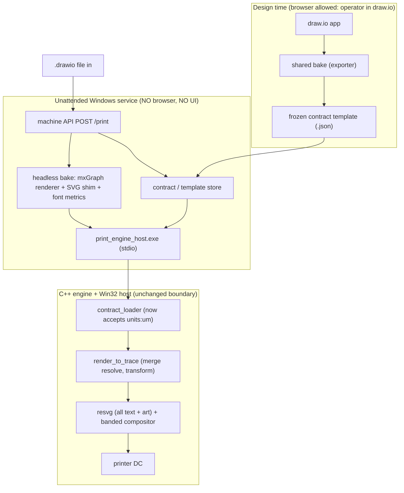

# Native Print — Unattended Printing: Implementation Specification

**Status:** Implementation-ready. The open decisions from the gap analysis are
**resolved** here (owner-delegated, 2026-05-25).
**Date:** 2026-05-25
**Repository:** `danielttran/drawio`
**Companion docs:**
`docs/NATIVE_PRINT_UNATTENDED_PRINTING_GAP.md` (why; options),
`docs/NATIVE_PRINT_DESIGN_TO_CPP_OUTPUT_SPEC.md` (current engine),
`docs/CLAUDE.md` (non-negotiable constraints).

## How to use this document (for the implementing agent)

Implement the phases in §7 in order. Every change must satisfy §0 (constraints)
and §8 (do-not list). The decisions in §1 are **settled** — do not re-open them.
Reuse the existing code identified in §9; do not reimplement draw.io or the
engine. Each phase has acceptance criteria that must pass in the **browser-free**
harness (`node --test`, `ctest`) before moving on.

---

## 0. Non-negotiable constraints (must hold at all times)

From `docs/CLAUDE.md`, restated so they are unmissable:

1. **No browser anywhere** — no Chrome, Firefox, Edge, Chromium, Electron,
   Puppeteer, Playwright, Selenium, **`jsdom`**, or any headless browser, at
   design time, print time, or test/CI time. No in-app/runtime **pixel oracle**
   (no canvas `getImageData`, no rasterizing `getSvg()`, no screenshot diffing).
2. **WYSIWYG by construction, not by comparison.** Capture draw.io's *actual
   rendered* output; never re-derive geometry; never silently approximate.
3. **Frozen, isolated engine boundary (INV-1).** No draw.io/mxGraph concepts in
   the C++ engine. Contract-schema changes only as specified in §4.
4. **No silent heuristic fallbacks** on the live path — faithful render OR a loud
   notice, always.

**Allowed-renderer boundary (decision D1, see §1).** Running draw.io's *own*
rendering JavaScript in Node against a **minimal SVG-serialization shim** is
permitted and is *not* a browser. The shim may implement only: element creation,
attribute/style get-set, child tree assembly, and XML serialization for the SVG
namespace. The shim **must not** implement HTML layout, the CSS cascade, box/flow
layout, `getClientRects`/`getBBox`-style measurement, event handling, or produce
pixels. Text measurement is done by a **font-metrics engine** (§3.5), never by the
shim. `jsdom` and any DOM/layout emulator remain forbidden.

---

## 1. Decisions (settled)

| # | Decision | Choice | Rationale |
|---|---|---|---|
| **D1** | Headless `.drawio` → contract | **Run draw.io's own renderer in Node under a minimal SVG-serialization shim (NOT jsdom) + font-metric text measurement.** Pre-baked contract *templates* are Phase 0 (stepping stone), not the end state. | Only path that prints arbitrary `.drawio` unattended while staying WYSIWYG-by-construction and browser-free. |
| **D2** | Fidelity guarantee | **Faithful-by-construction + deterministic.** Pixel-identity to a browser is NOT a goal (it would need a forbidden oracle). | Forced by §0.1/§0.2; verified by invariants + determinism, not comparison. |
| **D3** | Text rendering | **Unify ALL text (static and variable) on the resvg/font-metrics stack.** Use one shared font-metrics engine for both measurement and rasterization. Fonts are **host-installed**; preflight and **hard-fail** on a missing face in unattended mode. | One shaper ⇒ static and variable text are identical; removes the browser/resvg/GDI+ three-shaper divergence. GDI+ stays only for page compositing + printer DC, not text shaping. |
| **D4** | Contract units | **Add physical units: `units:"um"` (microns), `contract_units_per_inch = 25400`.** Keep `px` (=96) for back-compat. | Future-proof dimensional accuracy for medical/industrial output; the transform already divides by `contract_units_per_inch`, so the change is minimal. |
| **D5** | Unattended failure policy | **Any degradation notice ⇒ the job fails loudly and does not print.** (Interactive UI keeps the acknowledge gate.) | "Prints perfectly or does not print" — never a wrong medical label. |
| **D6** | Rasterization | **Banded/tiled rasterization** (bounded memory at high DPI), **AA control** per job/object (default on for art; off/threshold available for crisp edges), **determinism**: pin resvg + host font set, record backend + resolved fonts in `jobLog`. | High-DPI medical printers; reproducible, auditable output. |
| **D7** | Separate tracks | **Dynamic data = `T-Data`; barcodes = `T-Barcode`.** This spec builds the infrastructure and exact hooks (§5) but not those features. | As directed; keep them unblocked. |

---

## 2. Target architecture (no browser)

Two ingress modes, **one engine**:
- **Template mode (Phase 0):** API receives a pre-baked contract (or template id);
  no bake needed.
- **File mode (Phase 1+):** API receives a `.drawio` file; the **headless bake**
  produces the contract with no browser. The interactive UI converges onto this
  same bake (Phase 2).

---

## 3. Component specifications

### 3.1 Headless bake (D1) — `tools/native-print-bake/` (new, Node)

**Goal:** `.drawio` (model XML) → frozen contract JSON, no browser.

- **Reuse, do not rewrite:** the existing exporter logic in
  `src/main/webapp/plugins/nativeprint/exporter.js`
  (`buildContract`/`buildResult`, `svgCellNode`, `harvestShape`, `collectDefs`,
  `collectCellsInZOrder`, `transcribeForeignObjects`, `embedExternalImages`).
  These already run in Node in `exporter.test.mjs` against fake DOM objects.
- **Drive draw.io's renderer:** load mxGraph + draw.io shape code, render the
  model into SVG using the **SVG-serialization shim** (§0 allowed boundary).
  Output is draw.io's real SVG → frozen as `svg` contract nodes (WYSIWYG by
  construction).
- **Text measurement:** route all measurement (label fit/wrap, HTML-label
  transcription that currently uses `Range.getClientRects()`) to the
  **font-metrics service** (§3.5). Never DOM measurement.
- **HTML/rich labels:** keep the existing `transcribeForeignObjects` transcription
  approach but feed it font-metric measurements. Any HTML/CSS feature that cannot
  be faithfully transcribed/measured stays a **loud notice**
  (`RichApproximate`/`RichUnsupported`) — never silent.
- **Images:** reuse `embedExternalImages`; in Node the canvas path no-ops, so the
  service must supply image bytes via fetch/proxy. Unresolved image ⇒ loud notice.
- **Output:** the same contract shape the engine already consumes, in `units:"um"`
  (§4). Identical to what the converged UI bake produces.

**Key implementation risks (call out in PRs):** (a) the breadth of DOM methods
mxGraph touches — implement only the SVG subset and assert on anything else;
(b) HTML-label layout fidelity via font metrics — constrain the supported label
vocabulary and notice the rest.

### 3.2 Unattended host service + machine API (D5) — `tools/native-print-service/` (new)

- Windows service wrapping the existing host stdio protocol
  (`proto.cpp`: `Hello`→`GetCapabilities`→`RenderPreview`/`Print`). Reuse the
  framing/lifecycle pattern from `src/main/webapp/vite.config.mjs` **minus Vite,
  minus browser/Origin assumptions**.
- **API:** `POST /print { source, printerId, stockId, copies, data? }` where
  `source` is a `.drawio` file (→ §3.1 bake), a contract, or a template id;
  `data` is the optional merge map (consumed by `T-Data`). Return job id +
  `jobLog` + notices. Add auth.
- **Failure policy (D5):** before/after render, if **any** degradation notice is
  present, **fail the job** with the notice list; do not print. No acknowledge
  gate (there is no operator).
- **Font preflight (§3.5):** reject the job loudly listing any missing face
  *before* printing.
- No UI. No `/native-print/*` browser routes. No debug endpoints.

### 3.3 Engine changes — units (D4)

Minimal, additive (see §4 for the exact contract delta):
- `contract_loader.cpp`: accept `units == "um"` in addition to `"px"`
  (currently rejected at the `units.value() != "px"` check).
- Introduce a single helper `double units_per_inch(const std::string& units)`
  → `px`=96.0, `um`=25400.0.
- At the **two** `RenderTarget` construction sites in
  `host/win32_services.cpp` (`render_preview`, `print`, currently
  `RenderTarget{dpi, 96.0}`), derive the second field from
  `units_per_inch(doc.units)`.
- No change to `make_world_transform` (already `dpi / contract_units_per_inch`)
  or to any geometry math.

### 3.4 Rasterization (D2, D3, D6) — `host/win32_services.cpp`, `host/svg-rasterizer/`

- **Unify text on resvg (D3):** variable/merge text is rendered by generating an
  SVG `<text>` fragment at merge-resolve time (resolved value + font/size/box +
  computed auto-size) and rasterizing it through the **same resvg path** as baked
  `svg` artwork. Retire the GDI+ `DrawString` text path for *content* text (keep
  GDI+ only for compositing the opaque page bitmap and the printer DC blit). This
  makes static and variable text identical.
- **Banded rasterization (D6):** replace the single full-page
  `PixelFormat24bppRGB` bitmap in `print()` with horizontal **band** bitmaps so
  peak memory is bounded regardless of DPI/media size; composite each band, blit,
  free. Behaviour (pixels) must be identical to the full-page path for a band
  height equal to the page.
- **AA control (D6):** make `SmoothingMode`/`TextRenderingHint` and resvg's AA a
  **per-job (and optionally per-node) option**; default on for general art.
  Expose an "edge-crisp" mode (threshold / no-AA) for later use by `T-Barcode`
  and thermal output. Do not silently change current default behaviour.
- **Determinism + audit (D2, D6):** pin the resvg version and the host font set;
  extend `svg_pixel_determinism_tests` to cover the corpus; record backend
  identity (`spe_svg_backend_id`) and the resolved font list in `jobLog`.

### 3.5 Fonts (D3) — host-installed + preflight

- **Fonts are host-installed**, not embedded in the contract (settled). Required
  faces are a deployment prerequisite of the print server.
- **One font-metrics engine** shared by bake measurement and rasterization
  (e.g. resvg's `fontdb`/ttf-parser, or FreeType+HarfBuzz exposed to both Node and
  the host). Bake-time measurement and print-time rasterization must read the
  **same** metrics so layout computed at bake equals what prints.
- **Preflight:** a function that, given a contract, returns the set of referenced
  font faces not available on the host. Unattended mode: missing face ⇒ **fail
  loudly** (never silent Arial). Interactive mode keeps the `FontSubstituted`
  notice + ack.

---

## 4. Contract evolution — physical units (D4)

**The only schema change in this spec. Additive and back-compatible.**

- `document.units`: add allowed value `"um"` (microns) alongside `"px"`.
- Semantics: all numeric dimensions (`page.size`, `tile.origin/size`, every
  node `box`, font sizes) are expressed in the document's `units`.
- Engine mapping: `contract_units_per_inch` = `96` for `px`, `25400` for `um`;
  device dots = `value * dpi / contract_units_per_inch` (already implemented by
  the transform).
- Validation (`contract_loader.cpp`): accept `px`|`um`; everything else stays a
  `ContractEnumError`. All positivity/structure checks unchanged.
- Versioning: this is additive; bump `schema.minor` (1.0 → 1.1). The loader
  already treats minor-ahead as additive, so older `px` contracts keep working.

**Producer rule:** the headless bake (§3.1) and the converged UI bake emit
`units:"um"`. The legacy in-browser exporter may continue to emit `px`
(template/Phase-0 contracts); both are valid.

---

## 5. Separate-track integration hooks (do not implement here)

### `T-Data` (dynamic/variable data)

- Engine support already exists: `render_to_trace` resolves a `mergeData` map and
  raises `MergeResolveError`/`MergeOverflowError` with no browser
  (`src/main/native-print-engine/src/renderer.cpp`).
- This spec provides: the API `data?` field (§3.2), the unified text stack (§3.4)
  so variable text matches static text, and the auto-size machinery
  (font-metric measurement, §3.5) referenced by spec §11.5 of the design doc.
- `T-Data` must: make the bake emit `text` nodes with `content.type:"merge"` and
  (later) `barcode` nodes, instead of freezing sample values into `svg`; and add
  variable-text-box auto-sizing using the shared font metrics. **No browser.**

### `T-Barcode`

- Engine emits a loud stub today (`renderer.cpp` barcode branch). `T-Barcode`
  adds a native, deterministic, dot-grid-aligned symbology renderer using the AA
  "edge-crisp" mode from §3.4 (D6). Until it lands, any barcode = loud stub ⇒ in
  unattended mode (D5) a barcode label fails rather than prints. **No browser.**

---

## 6. Verification (browser-free)

Implement the corpus and tests defined in
`docs/NATIVE_PRINT_UNATTENDED_PRINTING_GAP.md` §9 (do not duplicate here):
corpus (§9.1), one-time human-captured golden contracts (§9.2), tests C1–C5
(§9.3), safe-unplug procedure (§9.4). All run in `node --test` / `ctest` against
static files — **no browser, ever**. C3/C4/C5 and the goldens can be built now;
C1/C2 activate when the headless bake exists.

**Definition of done = the gap doc §10**, plus: D1–D7 implemented, the schema
delta (§4) shipped with tests, and the corpus green before the live-DOM bake is
removed.

---

## 7. Phased delivery plan (with acceptance criteria)

**Phase 0 — Unattended service on contracts (no bake).**
Build §3.2 (API, host service, D5 fail-on-notice, §3.5 preflight) consuming
pre-baked contracts/templates. Build the §6 corpus + goldens + C3/C4/C5.
*Accept:* a contract prints unattended on Windows with no browser/UI; any notice
fails the job; missing font fails preflight; C3/C4/C5 green.

**Phase 1 — Units + rasterization hardening (engine/host).**
Implement D4 (§3.3, §4), D6 banded raster + AA control + determinism (§3.4).
*Accept:* `um` contracts render dimensionally exact at true DPI; banded output is
pixel-identical to full-page; determinism test green across the corpus; schema
delta has loader tests.

**Phase 2 — Headless bake (D1).**
Build §3.1 (SVG shim + font-metric measurement) reusing the exporter; emit `um`
contracts. Activate C1/C2 vs goldens.
*Accept:* `headless_bake(sample.drawio)` == golden (C1) and engine→engine pixel
equality (C2) across the corpus, with zero browser in the harness.

**Phase 3 — Text unification + bake convergence (D3).**
Route all content text through resvg (§3.4); point the interactive UI at the
headless bake; remove the live-DOM dependency only after the corpus is green.
*Accept:* UI and service produce identical contracts; static/variable text use
one shaper; C1–C5 green; live-DOM harvest removed.

**Parallel:** `T-Data`, `T-Barcode` (§5).

---

## 8. Do NOT (hard stops)

- Do **not** add a browser, headless browser, Puppeteer/Playwright/Selenium,
  Electron, or **`jsdom`**; do not build a DOM/HTML/CSS-layout emulator.
- Do **not** add a pixel-comparison/oracle of any kind (no canvas
  `getImageData`, no rasterizing `getSvg()`, no screenshot diff). Equivalence is
  engine→engine and structural only.
- Do **not** re-derive shape geometry in C++ or in the bake; ship draw.io's real
  rendered SVG. No heuristic fallbacks on the live path.
- Do **not** change the contract schema beyond §4. Other schema ideas →
  escalate.
- Do **not** make the bake measure text via DOM; use the font-metrics engine.
- Do **not** let unattended mode print when any degradation notice is present.
- Do **not** embed fonts in the contract; fonts are host-installed.

---

## 9. Where to implement (area map)

| Work | Location |
|---|---|
| Headless bake (Node) | `tools/native-print-bake/` (new); reuse `src/main/webapp/plugins/nativeprint/exporter.js` |
| SVG-serialization shim | `tools/native-print-bake/svg-shim/` (new) |
| Font-metrics service | shared lib usable by Node bake + C++ host (`host/` + `tools/`) |
| Unattended service + API | `tools/native-print-service/` (new); pattern from `src/main/webapp/vite.config.mjs` |
| Units (loader + helper) | `src/main/native-print-engine/src/contract_loader.cpp`, `include/print_engine/` |
| RenderTarget units wiring | `src/main/native-print-engine/host/win32_services.cpp` (2 sites) |
| Unify text on resvg | `src/main/native-print-engine/host/win32_services.cpp`, `host/svg-rasterizer/` |
| Banded raster + AA control | `src/main/native-print-engine/host/win32_services.cpp` |
| Font preflight | `host/` + service |
| Corpus + goldens + tests | `src/main/native-print-engine/tests/fixtures/labels/`, `tests/`, `exporter.test.mjs` |
| Schema delta tests | `src/main/native-print-engine/tests/contract_*_tests.cpp` |

---

## 10. Summary of decisions for the implementer

Print arbitrary draw.io files unattended on Windows with **no browser** by running
draw.io's **own** renderer headlessly (SVG-serialization shim, not jsdom) plus a
font-metrics engine; freeze to a `um`-unit contract; render **all** text and art
through one resvg-based, deterministic, banded, AA-controlled pipeline using
**host-installed** fonts; **fail loudly** on any notice. Prove equivalence with a
**browser-free** corpus + goldens before unplugging the live-DOM bake. WYSIWYG is
guaranteed **by construction and determinism**, never by pixel comparison. Dynamic
data and barcodes plug into the same browser-free pipeline as separate tracks.
